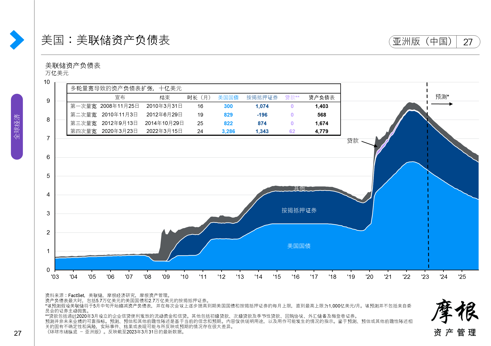

# 美联储

联邦储备委员会简称美联储(Federal Reserve System)，是美国的中央银行系统，负责制订美国的货币政策。
我们最常听到的美联储货币政策操作就是加息、降息和扩表、缩表，简单总结起来就是做“加减法”。

目标：将通胀率维持在 2%附近

备注：美联储不是政府部门,而是一个独立的实体,其权力来自美国国会。

## 联邦基金利率

英文是 Federal Funds Rates，主要有联邦基金有效利率 (Federal Funds Effective Rate) 和联邦基金目标利率 (Federal Funds Target Rate) 两种。

联邦基金目标利率 (Federal Funds Target Rate) 是由联邦公开委员会议 (FOMC) 制定的利率，在美联储 (Federal Reserve) 运行中，作为银行间互相借贷时收费利率的指导，起到最直接的调控作用，人们在日常中听到的“美联储加息”或“美联储降息”指的就是指联邦基金目标利率的增加或降低。

### 议息

是指美国 FOMC（Federal Open Market Committee）会议，即美联储公开市场委员会的会议。该会议的主要目的是决定美国的货币政策和利率决议。
FOMC 每年进行八次议息会议，讨论美国的经济和金融状况，并决定货币政策，其中包括美国的利率决议。美国议息会议通常持续一到两天，在会议结束后公布美国的议息结果，并在两个月内公布会议纪要的内容。

### 降息

降息也称为减息，主要是在经济发展疲软和衰退时，中央银行降低基准利率的动作。
基准利率作为一个国家的基础利率，降息也意味着银行和金融机构可以获取更低成本的资金，资本家们愿意借入大量美元，去市场上进行投资，比如：股市、房地、加密货币等，同时也会刺激消费、增加社会就业带动经济增长。

### 加息

与降息相对，加息使银行和金融机构借贷成本增加，进而迫使市场的利息也进行增加，利息太高资本家们贷款减少，而且如果利息足够高，资本家们也会把手里的资产兑换成美元，去银行里躺赢。市场上的钱变少了就会抑制社会投资和消费，经济就会降温。

## 资产负债表

央行资产负债表是指中央银行记录其资产、负债和净资产的会计表，其资产负债表反映了中央银行在履行其职责过程中所持有和管理的资产和负债。央行资产负债表的重要性在于它反映了央行在实施货币政策过程中的资金来源和运用情况，同时也反映了货币政策的效果和央行的风险承受能力。因此，资产负债表是市场和监管机构评估中央银行风险和可持续性的主要工具之一。

美联储资产负债表的主要项目包括：

资产端：

-   国债：美国政府发行的债券，是美联储的重要资产之一。
-   抵押贷款支持证券（MBS）：以抵押贷款为基础的证券化产品。
-   其他资产：可能包括其他证券、贷款、黄金等。

负债端：

-   流通中的美钞：已发行但未回到美联储的美元现钞
-   银行准备金：商业银行存放在美联储的准备金。
-   逆回购协议：与金融机构进行的短期回购交易。
-   财政存款：美国财政部在美联储的存款。
-   还有其他负债。

### 缩表

缩表是缩减资产负债表的简称，缩表英文为 Balance Sheet Reduction。缩表意思是央行通过减少其持有的债券和其他资产来缩小其资产负债表规模的政策，也是央行采取紧缩货币政策措施的一种。
缩表主要通过三种方式减少资产端资产：

1. 停止或减少资产再投资，即不再用到期的国债或 MBS 的本金来购买新的债券，到期不续或减少购买；
2. 公开市场上主动出售持有的债券和资产；
3. 或动用逆回购协议，从金融机构借入隔夜资金，同时抵押出国债或其他资产，短期内缩表减少市场上的流动性。

### 扩表

扩表就是央行不断地印钱去购买资产。当央行购买资产时，向银行系统注入新资金，这些资金以准备金的形式存在于商业银行的准备金账户上。商业银行可以利用这些增加的准备金进行放贷，从而通过贷款创造更多的存款货币（M1）。银行通过放贷活动将基础货币乘数化，从而增加广义货币供应（M2）。通过增加市场流动性，提升消费生产力，加大金融杠杆的方式来达到刺激经济的目的。

### 降息预期技术性指标

近 40 年的降息周期中，无论预防式降息还是纾困式降息，市场基本有个共识——满足 4%+2%即接近降息,要么 **#失业率#** >4%以"促进社会就业"为目标降息，要么 **#核心 PCE** ≈2%以"维持价格稳定"为目标降息。

### 美联储总负债

可近似认为是美联储向美国市场放出的美元流动性总规模（扩表代表流动性增加，缩表代表流动性降低，当然放缓缩表速度也代表流动性增加）

### 隔夜逆回购利率 ON RRP

是美联储在 2013 年推出的一个货币政策辅助工具，其目的是让美联储可以在短期内迅速吸收银行体系之外的超额美元，主要用来收缩市场上的美元流通性，是美联储利率走廊 (Interest Rate Corridor) 的下限利率，也就是俗称的“地板利率”。

隔夜逆回购其实起到了一个短期“缩表”的过程，由于市面上的美元进入了美联储账户，短期没有在市场上流通。

### 利率走廊

美联储会通过设置一个目标联邦基金利率 (Federal Funds Target Rate) 来调控市场上的美元流动性，也就是所谓的“锚定利率”。借助联邦基金利率，当市场出现通货膨胀时，美联储提高该利率值来抑制通货膨胀，控制物价上涨，当出现通货紧缩时，美联储就降低利率，增加市场货币流通性，刺激消费。

但是，实际使用中的利率并不是固定值，而是以目标基金利率为基础的一个利率区间，也就是俗称的“利率走廊”，英文是 Interest Rate Corridor，这个利率区间是美联储向金融机构提供贷款工具和存款工具时，提供的利率区间。而这个利率走廊的下限值就是由美联储设定的隔夜逆回购利率来限定的。

利率走廊下限是隔夜逆回购的利率 5.25%，上限是银行准备金利率 IORB 5.5%
