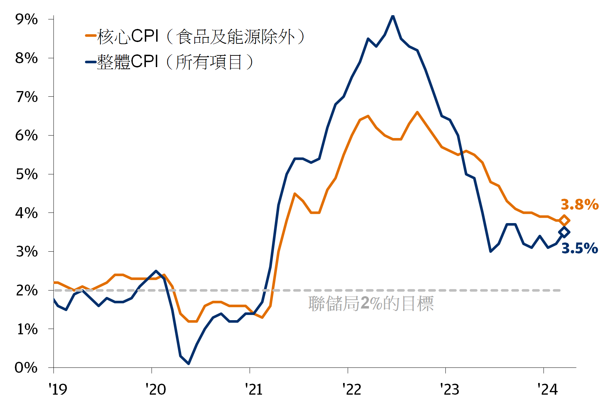
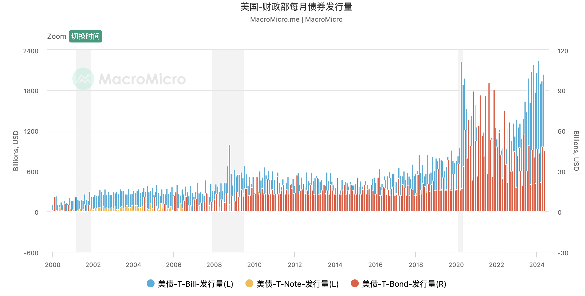

## CPI

CPI, 即消费者价格指数，衡量一篮子固定消费品和服务的平均价格水平的变化。

資料來源：美國勞工統計局、彭博財經。數據截至 2024 年 3 月 31 日。

## 美林时钟

美林时钟（Merrill Lynch Clock）是一种用于描述经济周期和资产配置的模型。它通过四个象限展示了经济周期的不同阶段，并建议在每个阶段中适合的资产类型。四个象限分别是复苏、过热、滞胀和衰退。以下是美林时钟的示意图描述：

1. **复苏阶段**（Recovery）：经济开始从衰退中复苏，增长缓慢但有起色，通胀低。
2. **过热阶段**（Overheat）：经济增长强劲，通胀开始上升，利率可能上调。
3. **滞胀阶段**（Stagflation）：经济增长放缓甚至停滞，但通胀仍然高。
4. **衰退阶段**（Recession）：经济萎缩，通胀下降，利率可能下调。
