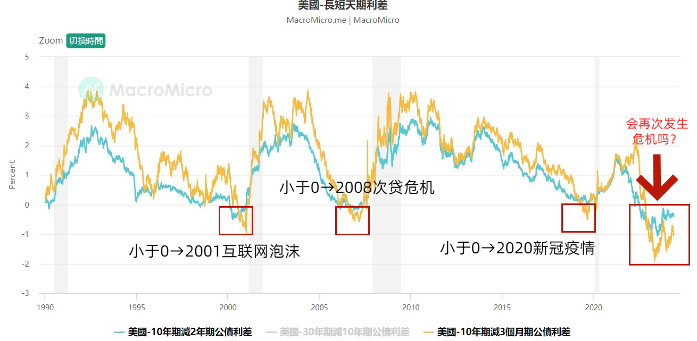

# 美国财政部

[美国财政部官网介绍](https://home.treasury.gov/utility/languages/zhongwenchinese/about)，不过对于市场来说，发债(印钞票)是美国财政部的任务，他们每三个月公布一次当季的发债计划。

美国国债的类型包括：

-   国库券，将在四到五十二周内到期的短期证券 - Treasury Bills, 简称 T-Bill。
-   票据，十年内到期的长期证券 - Treasury Note，简称 T-Note。
-   债券，长期证券，通常在 30 年后到期，每六个月支付一次利息 - Treasury Bonds ，简称 T-Bond。

TIPS：（美国国债通胀保值证券）、票据和债券，其本金根据消费者物价指数的变化进行调整。每六个月支付一次利息，到期日分别为五、十年和三十年。

## 收益率曲线倒挂

所谓“收益率曲线倒挂”就是指【10 年期国债利率 - 2 年期国债利率】或【10 年期国债利率 - 3 个月国债利率】是负数——这是一种反常识的现象！历史上往往发生了这个信号后就出现了经济危机。

常规想法：借钱时间越长，要还的利息也越多。但是美国的国债自 2022 年后进入了长期的 10 年国债利率低于 2 年国债利率的“倒挂”时期，反而借钱时间越长，利率越低。历史上，在 2001/2008/2020 这 3 次严重经济危机前夕都出现“收益率曲线倒挂”的现象，这也是为什么现在的很多研究机构认为一场大危机即将袭来。

据历史统计，收益率曲线倒挂平均十九个月后通常会发生衰退。

（\*TIPS：债券的价格越低，利率越高）

### 财政部主要支付帐户 TGA

TGA 由纽约联储管理，涵盖了美国政府的大部分日常业务的开支，政府税收和发债所得都会流入 TGA。
当美国公民或企业收到政府支票时，会将支票存入商业银行，商业银行将支票存到美联储的账户上，然后美联储将借方记在财政部的账户，贷方则记在银行的账户上，这样就增加了银行的准备金余额。
在美联储的资产负债表上，TGA 与银行准备金一样，都是负债
