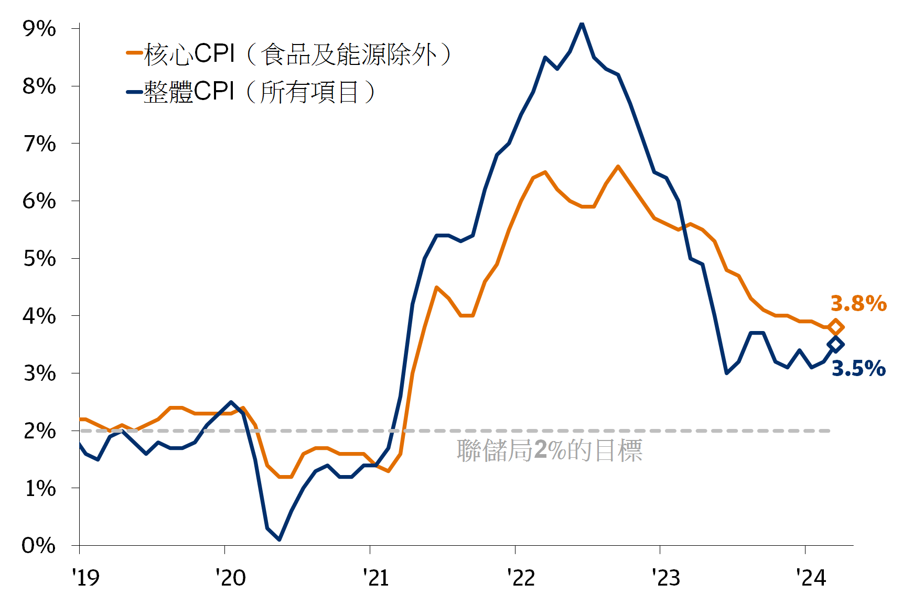
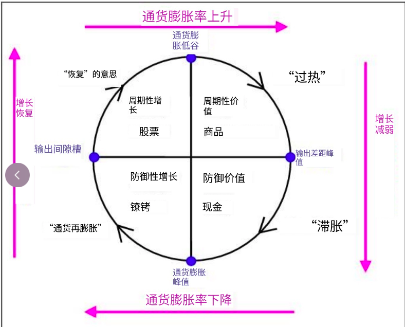

## CPI

CPI, 即消费者价格指数，衡量一篮子固定消费品和服务的平均价格水平的变化。

資料來源：美國勞工統計局、彭博財經。數據截至 2024 年 3 月 31 日。

## PPI

反映企业生产端的物价水平，一般会领先 CPI 1~3 个月。
但生产端的物价是否会完全传递到消费端 CPI 是不一定的，因为两者之间还有企业利润空间作为“蓄水池”

## PPI + CPI

具体来说 PPI+CPI 有 4 种组合：
【A】PPI 涨 + CPI 涨：经济过热趋势
【B】PPI 涨 + CPI 跌：生产端成本提高，但消费端物价未涨，说明总体来说企业的利润空间缩小，长期保持该趋势会导致企业减产进而走入通缩（当前组合）
【C】PPI 跌 + CPI 涨：生产端成本下降，但消费端物价上涨，说明企业利润空间增加，刺激企业扩张，长期保持该趋势容易进入通胀
【D】PPI 跌 + CPI 跌：经济衰退趋势，可能通缩

## PCE 个人消费支出物价指数

2002 年被美联储采纳为衡量通货膨胀的主要指标。2012 年美联储将核心 PCE 年率涨幅 2%定为长期通胀目标，从此将 PCE 直接量化挂钩货币政策。

个人消费支出的数据组成主要可以分成三大类区分：
耐久品：指使用年限较长的商品，如汽车、家具、房地产等。
非耐久品：指使用年限较短的商品，如食物、衣服、清洁用品等。
服务：指无形的商品，具有无法转售、储存或者退回的特性，如娱乐、医疗、交通等。

### 核心 PCE

核心 PCE 是去除价格波动性较大的商品类别，例如能源、食物等，较为精确的通货膨胀指标。

美国经济分析局（BEA）每月最后一周公布上个月的个人消费支出（PCE）和个人消费支出物价指数（PCEPI）等数据。
您可以在以下链接查看相关数据：https://www.bea.gov/data/consumer-spending

而从 PCE 和核心 PCE 的关系来看，去掉食品和能源的权重为 88.3%，可见作为政策目标的核心 PCE 通胀指数不仅仍然具有很强的代表性，而且更能够反映经济中长期的价格变化趋势，因为食品和能源短期波动较大。

# PCE、CPI 差异比较表

|              | 个人消费支出物价指数 PCEPI                | 消费者物价指数 CPI                        |
| ------------ | ----------------------------------------- | ----------------------------------------- |
| **目的**     | 显示物价变动与通货膨胀指标 (考量所有支出) | 显示物价变动与通货膨胀指标 (考量个人支出) |
| **统计机构** | 美国经济分析局(BEA)                       | 美国劳工统计局(BLS)                       |
| **统计对象** | 家庭及企业                                | 家庭                                      |

## 美林时钟

美林时钟（Merrill Lynch Clock）是一种用于描述经济周期和资产配置的模型。它通过四个象限展示了经济周期的不同阶段，并建议在每个阶段中适合的资产类型。四个象限分别是复苏、过热、滞胀和衰退。以下是美林时钟的示意图描述：

1. **复苏阶段**（Recovery）：经济开始从衰退中复苏，增长缓慢但有起色，通胀低。
2. **过热阶段**（Overheat）：经济增长强劲，通胀开始上升，利率可能上调。
3. **滞胀阶段**（Stagflation）：经济增长放缓甚至停滞，但通胀仍然高。
4. **衰退阶段**（Recession）：经济萎缩，通胀下降，利率可能下调。
